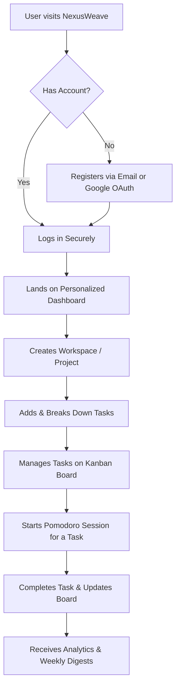
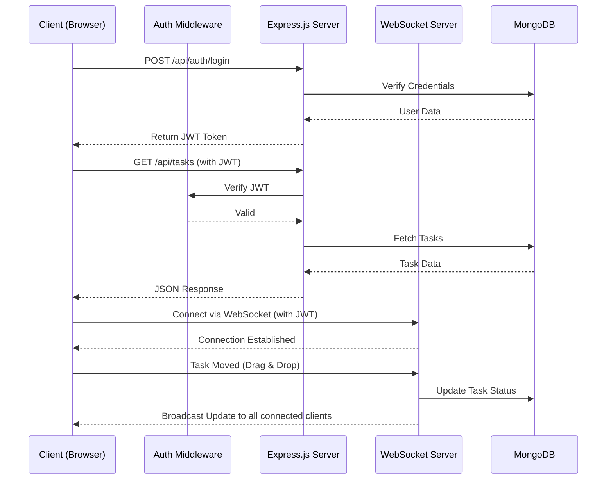

# NexusWeave 🚀


**NexusWeave** is a comprehensive productivity and task management platform designed to streamline workflows, organize projects, and enhance individual and team focus. It brings all the tools you need—kanban boards, pomodoro timers, and intelligent task breakdown—into one cohesive environment. 

Whether you're managing complex team projects or organizing your daily solo tasks, NexusWeave provides an intuitive, distraction-free interface to keep you on track. It is built for individuals and teams who struggle with context-switching and want a unified space for productivity.

By combining task management with actionable insights and focus tools, NexusWeave solves the problem of disjointed workflows and helps you accomplish more, faster.

---

## ✨ Key Features

| Feature Name | Description | Technical Implementation |
| :--- | :--- | :--- |
| **Authentication Flow** | Secure email/password login and Google OAuth integration. | JSON Web Tokens (JWT), bcryptjs, Google Auth Library |
| **Dashboard Experience** | Personalized dashboard with productivity charts, tracking, and light/dark mode. | Vanilla JS modules, CSS variables for theming, Charting libraries |
| **Project & Task Creation** | Organize workloads with workspaces; AI-assisted task breakdown. | Express.js REST APIs, MongoDB models |
| **Kanban Management** | Drag-and-drop task boards with Todo, In Progress, and Done columns. | Native HTML5 Drag and Drop API, WebSocket sync |
| **Filtering & Search** | Filter tasks by priority (High/Medium/Low) or due date ranges. | MongoDB aggregation pipelines, JS array filtering |
| **Focus / Pomodoro Mode**| Integrated timers to manage focus sessions directly in the app. | JavaScript `setInterval`, Web Workers for background timing |
| **Notifications** | In-app and email notifications for approaching deadlines and weekly digests. | WebSocket (`ws`) for real-time alerts, Cron jobs for emails |

---

## 🛤️ User Workflow



**Step-by-Step Journey:**
1. **Login/Registration:** The user securely logs in or signs up using email or Google OAuth.
2. **Dashboard Overview:** They are greeted by a personalized dashboard summarizing their tasks, productivity trends, and upcoming deadlines.
3. **Workspace Setup:** The user creates a new project workspace and begins adding tasks, optionally using AI to break them down into subtasks.
4. **Task Execution:** Tasks are moved across the Kanban board (Todo -> In Progress -> Done) as work progresses.
5. **Deep Work:** When it's time to focus, the user launches the integrated Pomodoro timer for a specific task.
6. **Review:** The system sends notifications for deadlines and a weekly email digest summarizing their accomplishments.

---

## 🏛️ System Architecture

NexusWeave uses a classic Client-Server architecture separated into a vanilla frontend and a robust Node.js backend. The frontend communicates with the backend via RESTful APIs for standard operations and WebSockets for real-time updates (like kanban board syncs and notifications). Data is persisted securely in MongoDB.



---

## 🗂️ Folder Structure

```text
webwondersnexusweave/
├── assets/         # Static assets (images, icons, fonts)
├── backend/        # Node.js backend server code
│   ├── config/     # Database and environment configurations
│   ├── controllers/# API endpoint business logic
│   ├── models/     # Mongoose database schemas
│   ├── routes/     # Express route definitions
│   ├── websockets/ # Real-time event handlers
│   └── server.js   # Main application entry point
├── pages/          # HTML views (Dashboard, Kanban, Focus mode, etc.)
├── scripts/        # Frontend Vanilla JavaScript modules and API services
├── styles/         # Global CSS, component styles, and theme variables
├── .gitignore      # Git ignore rules
├── index.html      # Entry point (redirects to /pages)
└── README.md       # Project documentation
```

**Important Directories:**
- `backend/`: Contains the entire Express.js API, database schemas, and authentication logic.
- `pages/` & `styles/` & `scripts/`: Form the frontend of the application, keeping structure, presentation, and logic cleanly separated using vanilla web technologies.

---

## 🚀 Installation & Setup

### Prerequisites
- [Node.js](https://nodejs.org/) (v16+ recommended)
- [MongoDB](https://www.mongodb.com/) (Local instance or MongoDB Atlas cluster)

### 1. Clone the Repository
```bash
git clone https://github.com/your-username/webwondersnexusweave.git
cd webwondersnexusweave
```

### 2. Backend Setup
Navigate to the backend directory and install dependencies:
```bash
cd backend
npm install
```

Configure your environment variables. Create a `.env` file in the `backend/` folder:
```bash
# backend/.env.example

PORT=5000
MONGODB_URI=mongodb+srv://<username>:<password>@cluster.mongodb.net/nexusweave?retryWrites=true&w=majority
JWT_SECRET=your_super_secret_jwt_key
GOOGLE_CLIENT_ID=your_google_oauth_client_id
```

Start the backend server:
```bash
npm run dev
```
*The server should now be running on `http://localhost:5000`.*

### 3. Frontend Setup
Because the frontend uses vanilla HTML/CSS/JS without a bundler, you can serve it using any static file server.

If using VS Code, install the **Live Server** extension, right-click the root `index.html`, and select "Open with Live Server".
Alternatively, using Node:
```bash
npx serve .
```
The root `index.html` will automatically redirect you to the main application views in `/pages/`.

---

## 💻 Usage / API Endpoints

### Example: Creating a new task
To create a new task programmatically, you can hit the `/api/tasks` endpoint with a POST request.

**Request:**
```javascript
fetch('http://localhost:5000/api/tasks', {
  method: 'POST',
  headers: {
    'Content-Type': 'application/json',
    'Authorization': 'Bearer YOUR_JWT_TOKEN'
  },
  body: JSON.stringify({
    title: 'Implement drag and drop',
    description: 'Use HTML5 drag and drop API for Kanban columns.',
    priority: 'High',
    workspaceId: '12345'
  })
})
```

**Response:**
```json
{
  "success": true,
  "data": {
    "_id": "60d5ec49c9g4...",
    "title": "Implement drag and drop",
    "status": "Todo",
    "priority": "High"
  }
}
```

---
*Built with ❤️ for productivity.*
