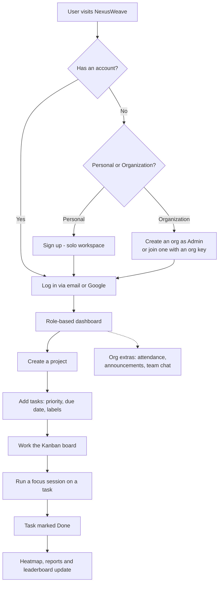
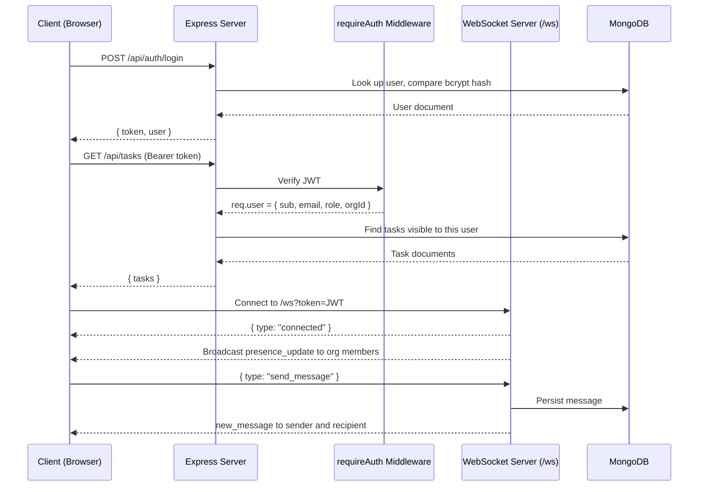

# NexusWeave

**NexusWeave** is a productivity and team-management platform that brings task boards, project tracking, focus sessions, and team coordination into one place. It works in two modes from the same codebase: a **Personal** workspace for solo users, and an **Organization** workspace with roles, attendance, announcements, leaderboards, and real-time chat.

It is built for people who lose time to context-switching across a task app, a timer, a chat tool, and a spreadsheet. NexusWeave replaces that split with a single interface where planning, doing, and reviewing all live together.

The frontend is deliberately dependency-free — no framework, no bundler, no build step. Everything is vanilla HTML, CSS, and JavaScript talking to an Express + MongoDB backend over REST and WebSockets.

---

## Key Features

| Feature | What it does | How it's built |
| :--- | :--- | :--- |
| **Dual-portal auth** | Email/password and Google Sign-In. One email belongs to either the Personal or the Organization portal, never both. | JWT, bcryptjs, `google-auth-library` |
| **Role-based dashboards** | Three distinct dashboard layouts for Personal, Admin, and Employee users. | `scripts/dashboard/dashboard.js` |
| **Kanban board** | Drag task cards between Todo, In Progress, Review, and Done. | Native HTML5 Drag and Drop API |
| **Task & project management** | Priorities, due dates and times, reminders, labels, assignment, and per-project grouping. | Express REST APIs + Mongoose models |
| **Search, filter, sort** | Filter by priority, status, project, label, and due-date range; free-text search; sortable and paginated. | Client-side filtering in `scripts/shared/task-board.js` |
| **Focus / Pomodoro mode** | Timer tied to a task, with ambient audio, a strict mode that blocks navigation, and logged sessions. | `setInterval`, state persisted to `localStorage` |
| **Contribution heatmap** | GitHub-style 365-day grid of completed tasks, with streak stats. | CSS grid + `GET /api/tasks/heatmap` |
| **Calendar** | Month grid of task deadlines with per-day counts; create tasks on a chosen date. | `GET /api/tasks/calendar` |
| **Reports & analytics** | Completion rate, priority distribution, per-project progress, and overdue items. Admins also get a weekly productivity chart and team leaderboard. | Chart.js + MongoDB aggregation |
| **Real-time direct messaging** | One-to-one chat between org members, with typing indicators, read receipts, and unread badges. | WebSocket (`ws`) + `Message` model |
| **Team attendance** | Members mark daily attendance; admins see a live roster, attendance rate, and history. | `Attendance` model with a unique index per user per day |
| **Announcements** | Admins publish org-wide announcements with file attachments. | `Announcement` model, base64 attachments |
| **Org administration** | Join by org key, public/private visibility, promote to admin, remove members, regenerate keys, leave org. | `backend/routes/orgs.js` |
| **Live presence & activity** | Online/offline status and a shared team activity feed, pushed as events happen. | WebSocket broadcast per organization |
| **AI assistant (MakAI)** | Chat assistant with workspace context — what to work on next, prioritization, weekly summaries. Falls back to a local rule-based engine with no key. | Browser-side OpenAI or Groq calls |
| **In-app notifications** | Deadline warnings, task assignments, new messages, and attendance updates. | Notification bell + toasts, WebSocket-driven |
| **Light / dark theme** | Per-user theme, remembered across devices. | `localStorage` + synced to the user profile |

### Deliberately not included

So there are no surprises: there is **no email sending or scheduled digest**, **no CSV/PDF export**, **no cloud file storage** (task attachments store filenames only; announcement attachments are embedded as base64), and **recurring tasks are not yet persisted**.

---

## User Workflow



**Step by step**

1. **Choose a portal.** The landing page separates Personal from Organization. Admins create an organization and receive a shareable org key; employees join with it.
2. **Land on a role-aware dashboard.** Personal users see their own stats and heatmap. Employees additionally see attendance and team notifications. Admins see team-wide analytics and controls.
3. **Set up work.** Create a project, then add tasks with priority, due date and time, reminders, and labels. Admins can assign tasks to specific members.
4. **Execute.** Move cards across the Kanban board, or use the list view with filters and search.
5. **Focus.** Launch the Pomodoro timer on a task. Completed sessions are logged and feed into your focus-hour totals.
6. **Review.** Completed tasks fill the contribution heatmap and reports. In an organization, they also feed the team leaderboard.

---

## System Architecture

NexusWeave is a client-server application. The Express server does double duty: it exposes the REST API **and** serves the static frontend, so in normal use everything runs on a single origin at port 4000. Standard operations go over REST; anything live — messages, presence, attendance, activity, task assignment — is pushed over WebSockets. MongoDB stores all persistent state.



**Startup behaviour worth knowing:** the HTTP server binds its port *before* connecting to MongoDB, so the app is reachable immediately on boot. While the database is still connecting, `/api/*` returns `503` with an explanation rather than hanging, and `/api/health` reports `degraded`. If the database connection fails, the server retries with exponential backoff instead of staying down.

---

## Folder Structure

```text
webwondersnexusweave/
├── assets/                     # Logos and images
├── backend/                    # Express API server
│   ├── middleware/
│   │   └── auth.js             # Bearer-token JWT guard
│   ├── models/                 # Mongoose schemas
│   │   ├── Activity.js         # Team activity feed entries
│   │   ├── Announcement.js     # Org announcements + attachments
│   │   ├── Attendance.js       # Daily attendance, unique per user per day
│   │   ├── FocusSession.js     # Logged Pomodoro sessions
│   │   ├── Message.js          # Direct messages
│   │   ├── Organization.js     # Orgs, admins, members, join key
│   │   ├── Project.js
│   │   ├── Task.js
│   │   └── User.js             # Password hashing + toSafeObject()
│   ├── routes/                 # Route handlers (logic lives here, not in controllers)
│   │   ├── activity.js         # GET /api/activity
│   │   ├── announcements.js    # GET, POST /api/announcements
│   │   ├── auth.js             # Signup, login, Google, profile
│   │   ├── focus.js            # Log sessions, focus summary
│   │   ├── messages.js         # Conversation history, unread counts
│   │   ├── orgs.js             # Org CRUD, members, attendance, leaderboard
│   │   ├── projects.js
│   │   └── tasks.js            # Tasks, heatmap, calendar
│   ├── utils/
│   │   ├── activity-log.js     # Fire-and-forget activity logging
│   │   ├── dates.js            # Local day keys and clock times
│   │   ├── ensure-indexes.js   # Reconciles stale indexes on boot
│   │   ├── google-auth.js      # Verifies Google ID tokens
│   │   ├── ids.js              # ObjectId and same-org helpers
│   │   └── jwt.js              # Sign and verify tokens
│   ├── .env.example
│   ├── package.json
│   └── server.js               # Entry point: Express app + WebSocket server
├── pages/                      # One HTML file per view
│   ├── index.html              # Landing page and auth
│   ├── dashboard.html          # Personal / Admin / Employee dashboards
│   ├── board.html              # Kanban board
│   ├── tasks.html              # Task list view
│   ├── create.html             # Create tasks and projects
│   ├── projects.html
│   ├── calendar.html
│   ├── focus.html              # Pomodoro timer
│   ├── reports.html
│   ├── org.html                # Organization management
│   ├── profile.html
│   ├── about.html              # Redirects to index.html#about
│   └── features.html           # Redirects to index.html#features
├── scripts/
│   ├── auth/auth.js            # Login, signup, Google OAuth, portal switching
│   ├── calendar/calendar.js
│   ├── create/create.js
│   ├── dashboard/dashboard.js  # Largest module: all three dashboard variants
│   ├── focus/focus.js
│   ├── org/org.js
│   ├── profile/profile.js
│   ├── projects/projects.js
│   ├── reports/reports.js
│   ├── services/
│   │   ├── ai-service.js           # OpenAI/Groq client + local rule engine
│   │   ├── api-client.js           # Every backend call goes through here
│   │   ├── productivity-tracker.js # Productivity scoring
│   │   └── socket-service.js       # WebSocket client with auto-reconnect
│   └── shared/                 # Cross-page modules
│       ├── task-board.js           # Kanban + list engine, drag/drop, filters
│       ├── notification-system.js  # Bell, toasts, announcements
│       ├── chat-widget.js          # Direct messaging drawer
│       ├── ai-assistant.js         # MakAI chat UI
│       ├── app-helpers.js          # Filtering, validation, keyboard shortcuts
│       ├── theme.js                # Light/dark toggle
│       └── ...                     # Profile menu, date picker, landing-page widgets
├── styles/                     # One stylesheet per area + global.css
├── index.html                  # Redirects to pages/index.html
└── README.md
```

**Note on the backend layout:** route files contain their own handler logic, so there is no separate `controllers/` directory. Likewise there is no `config/` folder — configuration is read from environment variables in `server.js` — and WebSocket handling lives in `server.js` rather than a `websockets/` folder.

---

## Installation & Setup

### Prerequisites

- [Node.js](https://nodejs.org/) v18 or newer (v24 recommended — the `dev` script uses `--watch-path`)
- A MongoDB database — a local instance or a [MongoDB Atlas](https://www.mongodb.com/atlas) cluster

### 1. Clone the repository

```bash
git clone https://github.com/arushag212-sketch/webwondersnexusweave.git
cd webwondersnexusweave
```

### 2. Install backend dependencies

```bash
cd backend
npm install
```

### 3. Configure environment variables

Create `backend/.env` (copy `backend/.env.example` as a starting point):

```bash
PORT=4000

# Local MongoDB, or an Atlas connection string
MONGODB_URI=mongodb+srv://<user>:<password>@<cluster>.mongodb.net/nexusweave?retryWrites=true&w=majority

# Optional but recommended. mongodb+srv:// relies on DNS SRV lookups, which Node
# resolves separately from the OS. If that resolver is misconfigured the SRV lookup
# fails even though normal DNS works. Put the non-SRV form of the same cluster here
# and the server falls back to it automatically instead of going down.
MONGODB_URI_FALLBACK=

# Required — the server exits on startup if this is missing
JWT_SECRET=a_long_random_secret
JWT_EXPIRES_IN=24h

# Allowed browser origin. Use * locally, or your deployed URL in production.
CLIENT_ORIGIN=*

# Optional — omit to disable the Google Sign-In button
GOOGLE_CLIENT_ID=your_google_oauth_client_id
```

If you use Atlas, add your IP under **Network Access** in the Atlas dashboard. A rejected IP is the most common cause of a failed connection, especially after switching networks.

### 4. Start the server

```bash
npm run dev     # auto-restarts on changes to routes, models, middleware, utils, server.js
npm start       # plain start, no watching
```

Then open **http://localhost:4000**. The Express server serves the frontend as well as the API, so there is nothing else to run.

You should see:

```
🚀 NexusWeave Backend Server running on http://localhost:4000
📡 WebSocket server initialized on ws://localhost:4000/ws
⏳ Connecting to the database...
✅ Connected to MongoDB Atlas
```

### Optional: serving the frontend separately

You can also open the frontend with a static server such as VS Code's **Live Server** or `npx serve .`. The API client detects that it is on a different port and points itself at the backend on the same hostname, so LAN and phone testing work. The backend must still be running on port 4000.

### Checking that it works

```bash
curl http://localhost:4000/api/health
```

```json
{
  "status": "online",
  "database": "connected",
  "databaseError": null,
  "websocket": "active"
}
```

A `status` of `degraded` means the server is up but the database is not connected — `databaseError` explains why.

---

## API Reference

All endpoints are prefixed with `/api`. Every route except those marked **Public** requires an `Authorization: Bearer <token>` header. Errors come back as `{ "errors": ["message"] }`.

### Auth

| Method | Endpoint | Notes |
| :--- | :--- | :--- |
| `POST` | `/auth/signup` *(alias `/auth/register`)* | **Public.** Returns `{ token, user }` |
| `POST` | `/auth/login` | **Public.** Returns `{ token, user }` |
| `POST` | `/auth/google` | **Public.** Exchanges a Google credential for a token |
| `GET` | `/auth/google/config` | **Public.** Returns the configured client ID |
| `GET` `PATCH` `DELETE` | `/auth/me` | Read, update, or delete the signed-in account |

### Tasks & Projects

| Method | Endpoint | Notes |
| :--- | :--- | :--- |
| `GET` `POST` | `/tasks` | List visible tasks, or create one |
| `PUT` `DELETE` | `/tasks/:id` | Update or delete |
| `GET` | `/tasks/heatmap` | `{ completionMap: { "YYYY-MM-DD": count } }` |
| `GET` | `/tasks/calendar` | Tasks plus `countsByDate` |
| `GET` `POST` | `/projects` | List or create |
| `PUT` `DELETE` | `/projects/:id` | Update or delete |

### Organization

| Method | Endpoint | Notes |
| :--- | :--- | :--- |
| `GET` | `/orgs/public` | **Public.** Joinable organizations |
| `GET` | `/orgs/users` | Members of your org |
| `GET` | `/orgs/online` | Live presence counts |
| `GET` | `/orgs/leaderboard` | Ranked team productivity |
| `GET` `POST` `DELETE` | `/orgs/attendance/mark` · `/attendance/today` · `/attendance/history` | Attendance |
| `POST` | `/orgs/join` · `/orgs/leave` | Membership |
| `PATCH` | `/orgs/:id` | Admin: rename, change visibility |
| `POST` | `/orgs/:id/promote` · `/orgs/:id/regen-key` | Admin actions |
| `DELETE` | `/orgs/:id/members/:email` | Admin: remove a member |

### Everything else

| Method | Endpoint | Notes |
| :--- | :--- | :--- |
| `GET` `POST` | `/announcements` | Read requires membership; posting requires admin |
| `GET` | `/messages/:userId` · `/messages/unread` | Conversation history and unread counts |
| `PATCH` | `/messages/read/:userId` | Mark a conversation read |
| `POST` | `/focus` · `GET /focus/summary` | Log a session, or summarise recent ones |
| `GET` | `/activity?scope=me\|org` | Activity feed (`scope=org` is admin-only) |
| `GET` | `/health` | **Public.** Server and database status |

### Example: creating a task

```javascript
const res = await fetch('http://localhost:4000/api/tasks', {
  method: 'POST',
  headers: {
    'Content-Type': 'application/json',
    'Authorization': `Bearer ${sessionStorage.getItem('jwt')}`
  },
  body: JSON.stringify({
    title: 'Implement drag and drop',
    description: 'Use the HTML5 drag and drop API for Kanban columns.',
    priority: 'High',
    dueDate: '2026-08-20',
    projectId: '66b1f0c2e4b0a1c2d3e4f5a6',
    labels: ['frontend']
  })
});

const { task } = await res.json();
```

Responds `201` with the created document:

```json
{
  "task": {
    "_id": "66b1f0c2e4b0a1c2d3e4f5a7",
    "title": "Implement drag and drop",
    "status": "Todo",
    "priority": "High",
    "dueDate": "2026-08-20",
    "userEmail": "you@example.com",
    "organizationId": null,
    "labels": ["frontend"],
    "createdAt": "2026-08-09T17:42:00.000Z"
  }
}
```

### WebSocket events

Connect to `ws://localhost:4000/ws?token=<JWT>`.

**Send:** `send_message`, `typing`, `mark_read`
**Receive:** `connected`, `new_message`, `user_typing`, `messages_read`, `presence_update`, `attendance_update`, `activity_update`, `task_assigned`

---

## Deployment Notes

- Set `CLIENT_ORIGIN` to your deployed URL rather than leaving it as `*`.
- Set a fresh, long, random `JWT_SECRET`. Changing it invalidates all existing sessions.
- In Atlas, allow your host's IP under **Network Access**.
- Because the frontend resolves the API from the current origin, a same-origin deployment needs no frontend configuration. Serve the whole repository through the Express server and point your host at `backend/server.js`.
- Never commit `backend/.env`. It is listed in `.gitignore` — keep it that way, and rotate any credential that has ever been committed.

---

## Tech Stack

**Frontend** — HTML5, CSS3 (custom properties for theming), vanilla JavaScript in IIFE modules, Chart.js via CDN, Google Identity Services. No framework and no build step.

**Backend** — Node.js, Express 4, MongoDB with Mongoose 8, `ws` for WebSockets, `jsonwebtoken`, `bcryptjs`, `google-auth-library`, `dotenv`.

---

*Built for the Future of Work & Productivity theme.*
